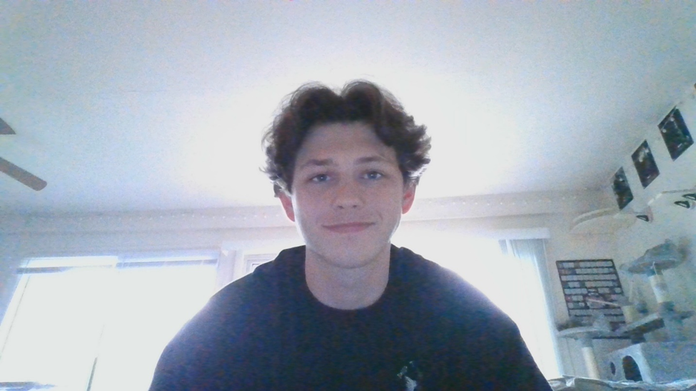

# CPS493-Class

So far, my computer experience has had its ups and downs. But lately, I have been enjoying it. Currently, I am studying computer science with a minor in DDF. I have taken CS1, CS2, CS3, Assembly, OS, OOP, and Software Engineering. My main project that I have worked on was my software engineering class project. We made a simple POS system, using Vue.js, Node.js, and Bulma. Using those in the past is hopefully going to help me in this class. 
I can see myself using what we learn in this course. My dream job is to be a video game developer. I am not totally sure if video game development takes part in typescript or CSS. But I am pretty sure I will be using a database in the future.